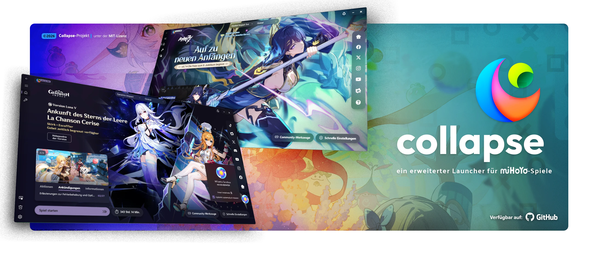

# _Hey Leute na!_ 👋
I'm **Rouven**, a 27 y/o hobbyist **graphic designer** and **volunteer translater/localizer** from Germany, focusing on logo and social media designs and sometimes some small hobby script projects.

## Graphic Design
Some examples of what I'm doing/was doing
|Logos|Headers|
|-----|-------|
|||

  

## Translator for

|Enka.Network|Collapse Launcher|
|------------|-----------------|
|||
|||

